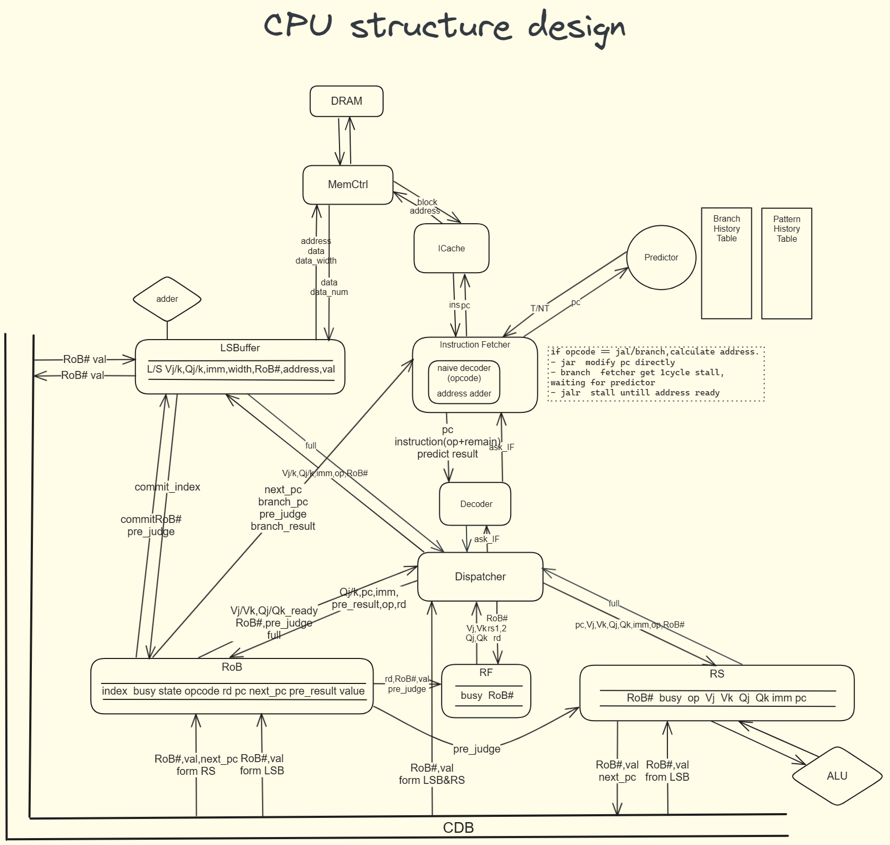

#  RISCV-CPU 2022

*本项目为sjtu 2022级ACM班计算机系统课程大作业。*

### 概述

本项目使用 Verilog 语言简单实现含分支预测器的乱序 RISC-V CPU ，采用Tomasulo 架构。Verilog 代码将以软件仿真和 FPGA 板两种方式运行。

### 指令集

本项目使用 **RV32I 指令集**，基础实现不包含 Doubleword 和 Word 相关指令、Environment 相关指令和 CSR 相关等指令。
#  

### 框架草图
#  

### 模块设计

#### Instruction cache

采用 **Direct-mapped** 设计。
#  
index = block address % block numbers，用于在确定 cache 中的块位置；tag 用于比对，确定是否命中。
